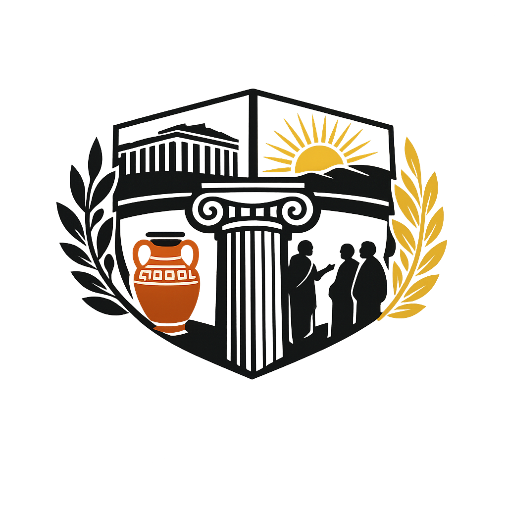

# 🏛️ Agora Audioführung - Digitale Zeitreise ins antike Athen

<div align="center">



**Eine interaktive digitale Audioführung durch das Herz der athenischen Demokratie**

[](https://uhland-gymnasium.de)
[](https://astro.build)
[](#lizenz--copyright)
[](#über-das-projekt)

</div>

## 🌐 Live Demo

**Erlebe die Audioführung direkt im Browser!**

Die vollständige Anwendung ist online verfügbar und kann sofort ohne Installation getestet werden:

### → [ag.x0000.de](https://ag.x0000.de) ←

_Optimiert für Desktop und Mobile | Alle 15 Audio-Stationen verfügbar_

## 🎯 Über das Projekt

Diese Webapplication wurde speziell für die **Griechenland-Fahrt 2026 des Uhland-Gymnasiums** entwickelt. Sie bietet Schülerinnen und Schülern eine digitale Reise durch die antike Agora von Athen mit 15 Audio-Stationen.

### 🎓 Bildungskontext

- **Entwickelt von**: Julius Grimm
- **Schule**: Uhland-Gymnasium
- **Anlass**: Griechenlandfahrt 2026

## 🗺️ Die 15 Stationen der Agora

<details>
<summary><strong>🏛️ Politische & Administrative Zentren (4 Stationen)</strong></summary>

| Station | Name                     | Beschreibung                                  |
| ------- | ------------------------ | --------------------------------------------- |
| **1**   | 🚪 **Eingang zur Agora** | Der historische Hauptzugang zum Herzen Athens |
| **6**   | 🏛️ **Bouleuterion**      | Versammlungsstätte des Rates der 500          |
| **7**   | ⭕ **Tholos**            | Amtssitz der demokratischen Prytanen          |
| **8**   | 📜 **Metroon**           | Staatsarchiv und Gesetzesaufbewahrung         |

</details>

<details>
<summary><strong>⛪ Religiöse Stätten (3 Stationen)</strong></summary>

| Station | Name                               | Beschreibung                                  |
| ------- | ---------------------------------- | --------------------------------------------- |
| **3**   | 🔥 **Altar der Zwölf Götter**      | Religiöser Mittelpunkt und Nullpunkt Athens   |
| **5**   | 🏗️ **Tempel des Hephaistos**       | Besterhaltener dorischer Tempel Griechenlands |
| **15**  | ⛪ **Kirche der Heiligen Apostel** | Byzantinisches Erbe in der Antike             |

</details>

<details>
<summary><strong>🎭 Kulturelle & Bildungseinrichtungen (4 Stationen)</strong></summary>

| Station | Name                            | Beschreibung                                    |
| ------- | ------------------------------- | ----------------------------------------------- |
| **2**   | 🎨 **Stoa Poikile**             | Die berühmte "Bunte Halle" mit antiken Gemälden |
| **4**   | 🎵 **Odeion des Agrippa**       | Konzertgebäude für 1000 Zuschauer               |
| **13**  | 📚 **Bibliothek des Pantainos** | Antikes Zentrum des Wissens                     |
| **14**  | 🏛️ **Stoa des Attalos**         | Rekonstruierte Säulenhalle und Museum           |

</details>

<details>
<summary><strong>🏪 Handel & Infrastruktur (4 Stationen)</strong></summary>

| Station | Name                                | Beschreibung                             |
| ------- | ----------------------------------- | ---------------------------------------- |
| **9**   | 🗿 **Monument der Eponymen Heroen** | Denkmal der athenischen Stammesgründer   |
| **10**  | 🏪 **Mittlere Stoa**                | Handels- und Geschäftszentrum der Antike |
| **11**  | 🏛️ **Süd-Stoa I**                   | Administrative Gebäude und Geschäfte     |
| **12**  | ⛲ **Südost-Brunnenhaus**           | Wasserversorgung der Agora               |

</details>

---

## 🚀 Technologie-Stack

### Frontend Technologies


</div>

### 🏗️ Architektur

```
🏛️ ag-x0000/
├── 📁 src/
│   ├── 🧩 components/          # Wiederverwendbare Astro-Komponenten
│   │   ├── 🖼️ Layout.astro      # Haupt-Layout mit Navigation
│   │   ├── 🎵 AudioPlayer.astro # Moderner Audio-Player
│   │   └── 📄 StationTemplate.astro # Stationen-Template
│   ├── 📝 pages/              # Astro File-based Routing
│   │   ├── 🏠 index.astro      # Landing Page mit Übersicht
│   │   ├── 🚪 station-1.astro  # Eingang zur Agora
│   │   ├── 🎨 station-2.astro  # Stoa Poikile
│   │   └── 📍 station-{3-15}.astro # Weitere 13 Stationen
│   ├── 🎨 styles/             # Design System
│   │   └── 🌐 global.css      # CSS Custom Properties & Themes
│   └── 🛣️ routes/             # Routing-Konfiguration
│       └── 📋 router.ts       # Stationen-Navigation
├── 📁 public/
│   ├── 🎵 audios/             # MP3 Audio-Dateien
│   │   ├── 🎧 station-01.mp3
│   │   └── 📻 station-{02-15}.mp3
│   └── 🖼️ logo.png           # Uhland-Gymnasium Logo
└── 📦 Package Management
    ├── 📄 package.json        # Dependencies & Scripts
    ├── ⚙️ astro.config.mjs     # Astro-Konfiguration
    └── 📝 tsconfig.json       # TypeScript-Setup
```

### 🔧 Technische Highlights

- **🚀 Astro Framework**: Server-Side Rendering für optimale Performance
- **🎨 CSS Custom Properties**: Konsistentes Design-System mit Dark/Light Mode
- **📱 Progressive Enhancement**: Funktioniert auch ohne JavaScript
- **🎵 Native Audio API**: HTML5 Audio mit benutzerdefinierten Kontrollen
- **♿ Accessibility**: WCAG-konforme Navigation und Bedienelemente
- **📐 Responsive Grid**: Mobile-First Design für alle Bildschirmgrößen

---

## 💻 Installation & Development

### Voraussetzungen

- **Node.js** 18+ (LTS empfohlen)
- **npm** oder **pnpm** Package Manager
- Moderner Browser (Chrome, Firefox, Safari, Edge)

### 🛠️ Setup

```bash
# Repository klonen
git clone https://github.com/your-username/ag-x0000.git
cd ag-x0000

# Dependencies installieren
npm install
# oder: pnpm install

# Development Server starten
npm run dev
# 🌐 Öffnet automatisch: http://localhost:4321

# Production Build erstellen
npm run build

# Production Preview
npm run preview
```

### 🔧 Scripts

| Command           | Beschreibung                      |
| ----------------- | --------------------------------- |
| `npm run dev`     | Development Server mit Hot Reload |
| `npm run build`   | Production Build generieren       |
| `npm run preview` | Production Build lokal testen     |
| `npm run astro`   | Astro CLI direkt verwenden        |

---

## 🎵 Audio-Management

### 📁 Audio-Datei Struktur

```
public/audios/
├── 🎧 station-01.mp3  # Eingang zur Agora
├── 🎨 station-02.mp3  # Stoa Poikile
├── 🔥 station-03.mp3  # Altar der Zwölf Götter
└── 📍 station-{04-15}.mp3  # Weitere Stationen
```

### 📋 Audio-Spezifikationen

- **Format**: MP3 (primär) mit OGG Fallback
- **Dauer**: 3-5 Minuten pro Station
- **Qualität**: Mindestens 128 kbps, empfohlen 320 kbps
- **Sprache**: Deutsch (Hochdeutsch)

## Nutzungsrechte

**© 2026 Julius Grimm | Uhland-Gymnasium**

| Berechtigung            | Status      | Details                            |
| ----------------------- | ----------- | ---------------------------------- |
| 📖 Bildungszweck        | ✅ Erlaubt  | Nur zur Ansicht und zum Lernen     |
| 💻 Code-Verwendung      | ❌ Verboten | Keine Weiterverwendung des Codes   |
| 🔄 Weiterentwicklung    | ❌ Verboten | Nur durch Julius Grimm autorisiert |
| 📋 Kopieren/Forken      | ❌ Verboten | Keine Kopien oder Forks erlaubt    |
| 🏢 Kommerzielle Nutzung | ❌ Verboten | Nicht für kommerzielle Zwecke      |

---

## 👨‍💻 Project Developer

<div align="center">

### Julius Grimm - Full-Stack Developer & UI/UX Designer

[](https://juliusgrimm.dev)
[](mailto:me@juliusgrimm.dev)
[](https://github.com/justthatrandomcoder)

**🏫 Entwickelt für das Uhland-Gymnasium | 🇬🇷 Griechenland-Fahrt 2026**

</div>

---

<div align="center">

## 🏛️ Bereit für die Zeitreise ins antike Athen?

[](https://ag.x0000.de)

**Entwickelt mit ❤️ für die Griechenland-Fahrt 2026**

---

_Die Demokratie wurde in Athen geboren - erlebe ihre Geburtsstätte!_ 🏛️✨

</div>
